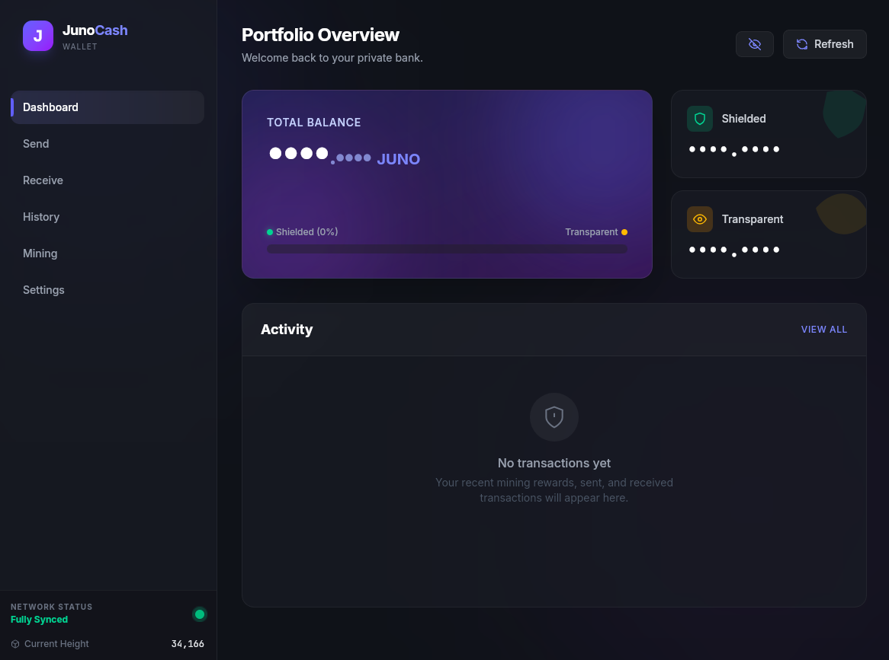

# JunoCash Wallet

A modern, privacy-focused desktop wallet for JunoCash built with Tauri, Vue 3, and Rust.



## Features

- **Portfolio Dashboard**: View total balance, shielded and transparent funds with visual breakdowns
- **Send & Receive**: Manage transactions with support for both transparent and shielded addresses
- **Integrated Mining**: Built-in CPU miner with configurable thread allocation
- **Auto-Shielding**: Automatically shield mined coinbase transactions for enhanced privacy
- **Transaction History**: Complete activity log with filtering and search
- **Node Management**: Launch and manage your own JunoCash node directly from the wallet
- **Balance Privacy**: Toggle balance visibility for privacy in public settings
- **System Tray**: Close to tray for background operation

## About

This is a GUI wrapper for the JunoCash daemon (`junocashd`) that provides a modern interface for node management, wallet operations, and mining. It communicates with your local node via RPC - private keys never leave the daemon.

## Technology Stack

- **Frontend**: Vue 3, TypeScript, TailwindCSS
- **Backend**: Rust, Tauri 2.0
- **Communication**: JSON-RPC to JunoCash daemon

## Quick Start

### Prerequisites
- [Rust](https://rustup.rs/) 1.70+
- [Node.js](https://nodejs.org/) 18+ and [Bun](https://bun.sh/)
- [JunoCash daemon](https://github.com/junocash/junocash) (junocashd)

### Installation

```bash
git clone https://github.com/fvckgrimm/junocash-wallet.git
cd junocash-wallet
bun install
bun run tauri build
```

Binaries output to `src-tauri/target/release/bundle/`

**Development mode:**
```bash
bun run tauri dev
```

### First Launch

1. Open **Settings**
2. Point to your `junocashd` binary and data directory
3. Set RPC credentials
4. Launch node or connect to existing instance

Full setup guide: [docs/configuration.md](docs/configuration.md)

## Documentation

> **Note:** Documentation is currently AI-generated and undergoing review. Accuracy is being verified.

- [Configuration Guide](docs/configuration.md) - Initial setup and node configuration
- [Mining Guide](docs/mining.md) - CPU mining and auto-shielding
- [Building Guide](docs/building.md) - Platform-specific build instructions
- [Troubleshooting](docs/troubleshooting.md) - Common issues and solutions
- [Architecture](docs/architecture.md) - Technical overview and RPC commands

## Support

**Issues:** [GitHub Issue Tracker](https://github.com/yourusername/junocash-wallet/issues)

**Community:**
- Discord: [discord.gg/junocash](https://discord.gg/junocash)
- Developer contact: [grimm.wtf](https://grimm.wtf/)

## License

MIT License - See [LICENSE](LICENSE) for details

